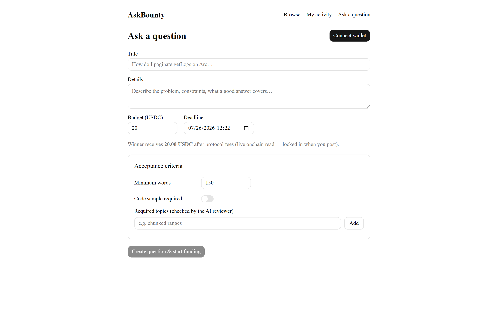
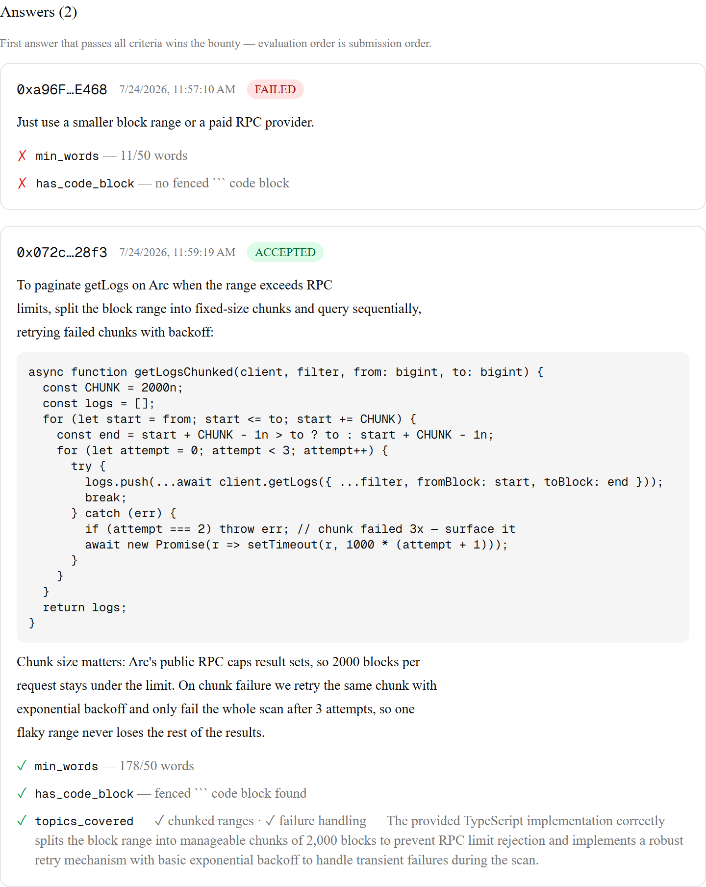
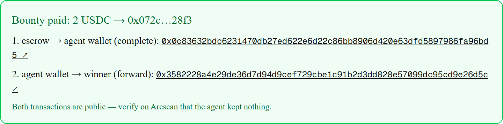

# AskBounty

**Ask a question, lock USDC in onchain escrow — an AI agent evaluates the answers and pays the first one that passes, instantly.**

Built for the **"Build on Arc" hackathon**, Agentic Economy track.

🔗 **Live demo: https://askbounty.vercel.app**

## Try it in 2 minutes (no wallet needed to look around)

Three pre-seeded questions show every state of the money flow:

| Link | What you'll see |
|---|---|
| [Answered & paid](https://askbounty.vercel.app/q/q66yq8uodfp9) | A lazy answer **rejected with per-check reasons**, a strong answer **accepted**, and the dual-tx receipt — escrow→agent and agent→winner, both with Arcscan links proving the agent kept nothing. |
| [Open bounty](https://askbounty.vercel.app/q/qriraz09r94x) | A live, funded question with 7 days left. Connect any wallet with a bit of Arc Testnet USDC and submit an answer — evaluation runs while you watch (submitting is free, you only sign a message). |
| [Expired & refunded](https://askbounty.vercel.app/q/q3g982tmydva) | Nobody answered before the deadline → the locked bounty went back to the asker, with the refund tx linked. Funds can never be stranded. |

To go through the full asker flow yourself: get Arc Testnet USDC from https://faucet.circle.com (network "Arc Testnet"), then [ask a question](https://askbounty.vercel.app/ask). USDC is also the gas token on Arc — one faucet visit covers both.

## Screenshots

| Ask + criteria builder | Evaluation feedback | Payout receipt (2 tx) |
|---|---|---|
|  |  |  |

## How it works

```
Asker                    AskBounty agent wallet                Answerer
  │                                │                               │
  │ 1. createJob + fund USDC       │                               │
  ├──────────────► ERC-8183 escrow │                               │
  │        (AgenticCommerce)       │      2. signed answer (free)  │
  │                                │ ◄─────────────────────────────┤
  │                                │ 3. evaluate: objective checks │
  │                                │    (words, code) then LLM     │
  │                                │    verdict on asker criteria  │
  │                                │ 4. pass → complete()          │
  │                 escrow ──USDC──► agent wallet                  │
  │                                │ 5. forward FULL amount        │
  │                                ├──────────USDC────────────────►│
  │  (no pass by deadline: claimRefund → budget returns to asker)  │
```

- **Escrow**: the budget is locked in the shared ERC-8183 `AgenticCommerce` contract the moment the question goes live — the asker cannot rug-pull answerers.
- **Evaluation**: free objective checks run first (min words, code block present); only answers that pass them reach the LLM, which judges the asker's written criteria topics and returns a structured verdict with quotes as evidence. Uncertain → fail closed, funds stay in escrow.
- **Payout — "the agent kept nothing"**: the contract releases the escrow to the agent wallet (it is the registered provider — see limitations), and the agent immediately forwards **the exact released amount** to the winner in a second transfer. Every receipt shows both transactions so anyone can verify the agent retained zero.
- **Refund**: a daily cron sweep flips past-deadline questions to `expired`; the asker then claims the refund straight from the contract.

| Item | Value |
|---|---|
| Network | Arc Testnet, chain ID `5042002` |
| AgenticCommerce (ERC-8183) | `0x0747EEf0706327138c69792bF28Cd525089e4583` |
| USDC (6 decimals, also gas token) | `0x3600000000000000000000000000000000000000` |
| Explorer | https://testnet.arcscan.app |
| Agent wallet | `0x8065E80AE2155412d896A5FF761933F8D129c200` |

## Stack

Next.js (App Router) + TypeScript + Tailwind + shadcn/ui · viem/wagmi · Supabase (service-role writes only, RLS denies client writes) · **Google Gemini API (free tier)** for answer evaluation · Vercel (cron: daily expiry sweep).

> **LLM provider note:** the PRD specifies the Claude API for evaluation; the demo runs on Gemini free tier for cost reasons (PRD-ERRATA E5). The eval client is provider-swappable — switching back touches only `lib/eval/llm-client.ts` (same input/output interface, structured JSON verdict: `topics[]`, `overall`, `reasoning`).

## Known limitation: agent is both provider and evaluator

The shared pre-deployed AgenticCommerce contract sets the provider at job creation and only allows `ADMIN_ROLE` to change it while the job is still `Open`. We hold no admin role, and the winning answerer is unknown until after funding — so assigning the winner as onchain provider is impossible ("Option A" in the PRD).

We therefore run **Option B**: the AskBounty agent wallet is the fixed provider **and** evaluator for every job. On acceptance, `complete()` pays the escrow out to the agent wallet, and the agent immediately forwards **the full amount the escrow released to it** to the winner in a second ERC-20 transfer — the agent never retains any part of the release, including any future evaluator fee ("what comes in goes out"). This is a centralization trade-off, disclosed openly:

- The budget is still provably locked in escrow from the moment the question is posted — the asker cannot rug-pull answerers.
- Every receipt shows **both** transactions (escrow→agent and agent→winner) with Arcscan links, so anyone can verify the agent kept nothing. If the released amount ever differs from the snapshot shown at question creation (admin fee change), the full released amount is still forwarded and the receipt displays both numbers; an ambiguous multi-leg release fails loud (`payout_failed`) rather than guessing.
- The winner receives **exactly** the net amount displayed on the question page before anyone wrote a word ("Bounty 20 USDC · winner receives X.XX USDC after protocol fees" — computed from live `platformFeeBP`/`evaluatorFeeBP` reads, never hardcoded). Forward-hop gas is absorbed by the agent wallet, never deducted from the winner.
- The trust assumption is: the agent wallet forwards the payout honestly. A payout state machine (`accepted → payout_pending → paid`) with cron retries and a visible "payout pending" status makes any failure loud, not silent.
- Pending answers are publicly readable; acceptance order follows submission order, so copying a pending answer cannot outrank the original. Private submissions are a v2 item.
- Askers reclaim funds via expiry refund; explicit early-cancel is a v2 convenience. The escrow always has a refund path once the deadline passes, so funds can never be stranded — cancel would only add convenience, not safety.
- The LLM evaluator has no real-time knowledge beyond the injected current date; questions requiring live external facts (prices, news) are out of scope for reliable auto-evaluation. When the evaluator cannot judge reliably, it fails closed: the bounty stays in escrow and refunds at expiry, so funds are never misdirected.
- Expiry is swept by a daily cron (`/api/cron/sweep`, Vercel Hobby limit), so a question can sit past its deadline for up to 24h before the refund button appears; browse already hides past-deadline questions, and the escrow itself is claimable the second `expiredAt` passes.
- `claimRefund` on the deployed contract is permissionless as to CALLER, but the funds always go to the asker (verified live, PRD-ERRATA E6) — the asker-only refund button is a UX choice, not the security boundary. The recorded receipt link is verified by decoding the tx calldata (`claimRefund(jobId)`), so it cannot be forged.

## Run it locally

```bash
npm install
cp .env.example .env.local   # fill secrets (see below)
npm run dev
```

### Environment

See `.env.example`. Public chain constants are prefilled. You must supply: `EVALUATOR_PRIVATE_KEY` (agent wallet), `GEMINI_API_KEY`, `CRON_SECRET`, and the Supabase trio. Gas on Arc is USDC — the agent wallet must hold testnet USDC.

### Database

Run `lib/supabase/schema.sql` (plus `lib/supabase/migration-00*.sql` in order) in the Supabase SQL editor. RLS is enabled with public read and **no** client write policies — all writes go through API routes using the service-role key.

### Onchain dry-run (Phase 1 gate)

```bash
npx tsx scripts/dry-run-lifecycle.ts
```

First run generates throwaway wallets into `.env.local` and prints funding instructions. Fund the asker + agent wallets with Arc Testnet USDC via https://faucet.circle.com (select "Arc Testnet"), then re-run. A passing run executes `createJob → setBudget → fund → submit → complete → forward` and prints the live fee BPs, the resolved `setBudget` caller, and both payout tx links.

### Seed the demo data

```bash
# against a running deployment (dev server or prod URL)
E2E_BASE_URL=https://askbounty.vercel.app npx tsx scripts/seed-demo-data.ts
```

Creates the three demo questions above (the refunded one waits out a real 10-minute deadline). Staged runs are supported — see the script header.
